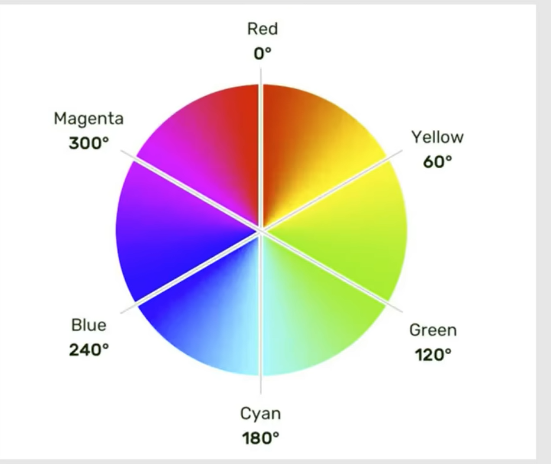
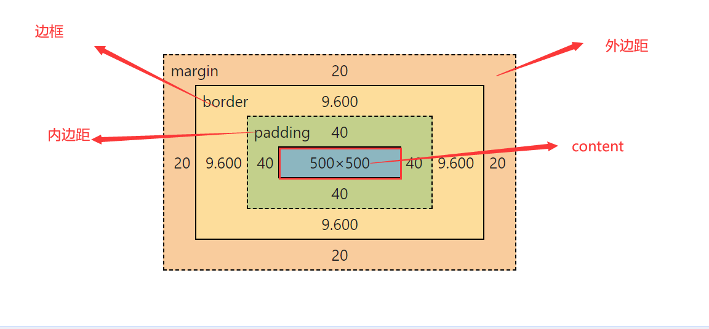
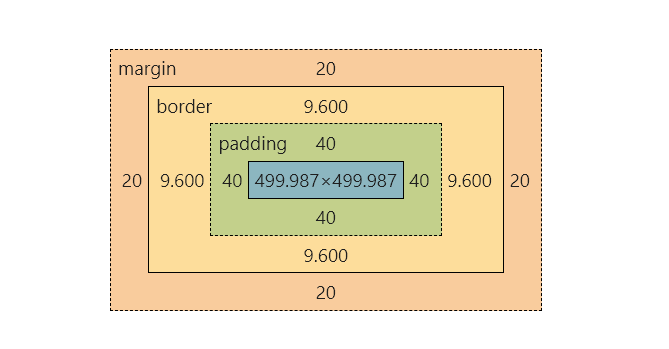
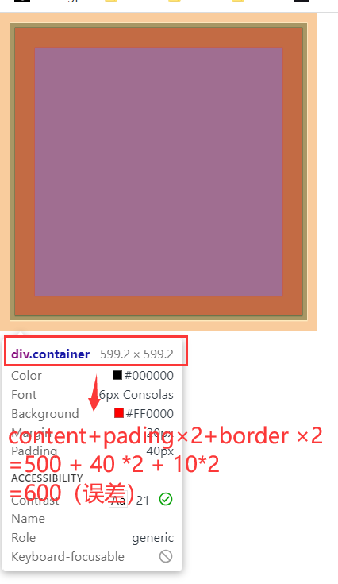
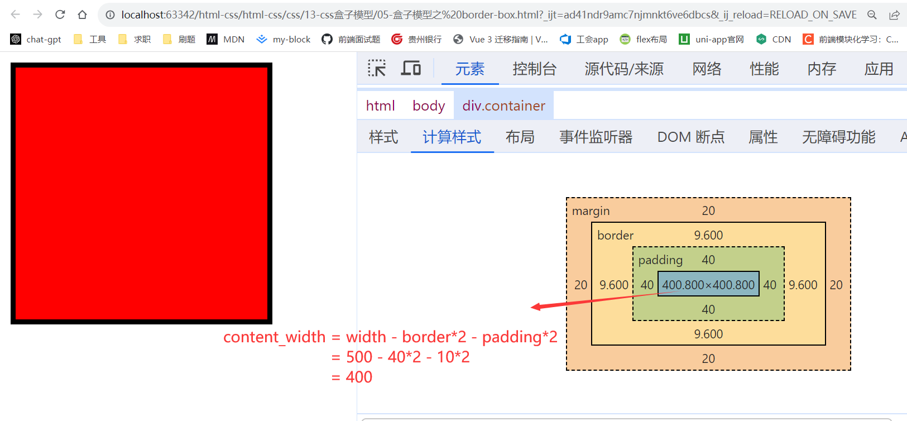

# css学习笔记
## 一、css样式的三个位置
1. 行内样式
```html
<h1 style="color: red; font-size:30px;"></h1>
```
2. 内部样式
```css
.container {
    color: red;
}
```
3. 外部样式
```html
<link rel="stylesheet" href="./index.css">
```
**优先级：** 行内样式>外部样式=内部样式 （外部样式和内部样式的优先级取决于谁在后面）
## 二、基本选择器
### 1. 交集选择器
同时符合多个条件的元素，既...又...
```html

<head>
    p.p1#p1{
    color: red;
    font-size: larger;
    }
</head>
<html>
<p class="p1" id="p1">Lorem ipsum dolor.
<p>
</html>
```
### 2. 并集选择器
选择符合条件的多个元素
```html

<head>
    p4,p5{
    color: red;
    font-size: larger;
    }
</head>
<html>
<p class="p4">Doloribus, magnam, ullam?</p>
<p class="p5">Consectetur laborum, rerum?</p>
</html>
```
### 3. 后代选择器
   后代选择器后代 包括儿子、孙子、重孙子,选择指定元素的符合要求的元素

```css
ul li {
    color: green;
}

ul .li3 {
    color: yellow;
}

ul #li4 {
    color: darkmagenta;
}

ul li a.classA {
    color: aquamarine;
}
```
### 4. 子代选择器 
后面一代（儿子）

```css
div > a {
    color: red;
}

div > p > a {
    color: blue;
}

/*后代+子代*/
div .foot > a {
    color: green;
}
```

### 5. 兄弟选择器
   兄弟选择器有两种：

- \+ 找仅仅相连的第一个兄弟（只能是第一个）
- ~  找其后第一个满足条件的兄弟

```html

<head>
    <style>
        /*只选中id = p1*/
        div + p {
            color: #ff4a7b;
        }

        /*选中p p2*/
        span ~ p {

        }

    </style>
</head>
<body>
<div class="div1">Lorem ipsum.</div>
<a href="#">点我</a>
<span></span>
<p id="p">Lorem ipsum.</p>
<div class="div2"></div>
<p id="p1">Aliquid, placeat.</p>
<span id="p2"></span>
<p>Id, suscipit?</p>
</body>
```
### 6.属性选择器
1. [propertyName] 具有propertyName属性的元素
2. [propertyName=“propertyValue”] 具有propertyName属性，且属性值等于propertyName.
3. [propertyName^="pre"] 具有propertyName属性，且属性值以pre 开头。
4. [propertyName$="end"] 具有propertyName属性，且属性值以end 结尾。
5. [propertyName\*="content"] 具有propertyName属性，且属性值包含content。
```html
<!DOCTYPE html>
<html lang="en">
<head>
    <meta charset="UTF-8">
    <title>属性选择器</title>
    <style>
        /*具有class 属性的元素 */
        [class] {
            color: orange;
        }
        /*具有class 属性 且值为div1 的元素 */
        [class="div1"] {
            color: red;
        }

        /*具有class 属性 且属性值以my开头 */
        [class^="my"] {
            color: orchid;
        }
        /*具有id 属性 且属性值以end结尾 */
        [id$="end"] {
            color: yellowgreen;
        }

        /*具有id 属性 且属性值包含haha */
        [id*="haha"] {
            color: green;
        }

    </style>
</head>
<body>
<div class="div1">Lorem ipsum.</div>
<div class="div2" id="div2">Facere, nulla!</div>
<div class="my-div" id="div5">Facere, nulla!</div>
<div id="div3">Maxime, praesentium.</div>
<div id="div4-end">Iure, voluptatibus?</div>
<div id="haha1">Lorem ipsum.</div>
<div id="haha2">Architecto, iure!</div>
</body>
</html>
```

## 三、伪类选择器

### 1. 动态伪类

- ele:link 没有访问过(常用于a标签)
- ele:visited 访问过(常用于a标签)
- ele:hover 鼠标覆盖)
- ele:active (按下鼠标)
- input:focus(获得焦点，只能用于表单类元素)

```html
<!DOCTYPE html>
<html lang="en">
<head>
    <meta charset="UTF-8">
    <title>伪类选择器概念</title>
    <style>
        /*记忆*/
        /*lvha 顺序不能乱，后来居上*/
        /* .baidu{
           color: green;
         }*/
        /*像类不是类 元的的特殊状态的一种描述*/
        /*选中没有访问过的*/

        /*注意顺序，后来居上*/
        /*没有访问过*/
        a:link {
            color: green;
        }

        /*访问过*/
        a:visited {
            color: red;
        }

        /*鼠标悬浮*/
        a:hover {
            color: blueviolet;
        }

        /*激活(鼠标按下没有松手)*/
        a:active {
            color: orange;
        }

        /*hover和active是所有元素都有的*/
        span:hover {
            color: aqua;
        }

        span:active {
            color: red;
        }

        /*focus获得焦点，只有表单类元素才有用*/
        select:hover, input:focus {
            background-color: aqua;
        }

    </style>

</head>
<body>
<a href="http://www.baidu.com" class="baidu">百度</a>
<a href="https://www.jd.com">京东</a>
<br>
<br>
<span>
    Lorem ipsum dolor sit amet, consectetur.
</span>
<br>
<br>
<input type="text"/><br><br>
<input type="text"/><br><br>
<input type="text"/><br><br>
<select name="lorem" id="lorem">
    <option value="">Lorem.</option>
    <option value="">Aspernatur.</option>
    <option value="">Eius?</option>
    <option value="">Obcaecati?</option>
</select>
</body>
</html>
```

### 2. 结构伪类
所谓结构伪类，就是需要知道dom结构以后才能进行选择的一种选择方式。格式为（element:example）example是element的特征。常见的结构伪类有
**child**

- ele:first-child
- ele:last-child
- ele:nth-child(an+b)
- ele:nth-last-child(an+b) 倒数


**of-type**
- ele:first-of-type  (同类型兄弟（ele类型）的第一个)
- ele:last-of-type (同类型兄弟（ele类型）的最后一个)
- ele:nth-of-type(an+b) 类似nth-child(同类型（ele类型）参与计算)
- ele:nth-last-of-type(an+b)

**other**

- ele:only-child 独生子
- ele:only-of-type 没有同类形状的兄弟
- ele:empty 空（没有内容）

关于an+b的说明:a,b是常数，n是一个从零开始递增的常数
常见的例子：
1. 0 或者什么都不写，什么都选不中
2. n 所有
3. 5 第五个
4. 2n 偶数
5. 2n+1 奇数
6. -n + 5 前5个

```html
/*div 的后代中选择第一个儿子（不管是谁的儿子，第一就行）*/
<style>
    /*选中id=1、2*/
    div p:first-child {
        color: blue;
    }

    /*id=last*/
    p:last-child {
        color: red;
    }

    /*class=2*/
    p:nth-of-type(2) {
        color: #ff4a7b;
    }

    span:only-child {
        color: #ff4a7b;
    }

    /*没有同类型兄弟的元素*/
    span:only-of-type {
        color: blueviolet;
    }

    /*根元素 html*/
    :root {
        background-color: aliceblue;
    }

    /*div中没有内容 文本空格都不能有*/
    div:empty {
        width: 200px;
        height: 100px;
        background-color: green;
    }
</style>
<body>
<div>
    <p id="1">Lorem ipsum dolor sit.</p>
    <span>
      <p id="2">Lorem ipsum dolor sit.</p>
      <p class="2">Culpa debitis pariatur repellendus?</p>
   </span>
    <p class="2">Lorem ipsum dolor.</p>
    <p id="last">Ab autem exercitationem quisquam?</p>
</div>
</body>

```

### 3. UI伪类

常见的UI伪类：

1. input:checked 选中的复选框
2. input:disabled 禁用的输入框
3. input:enabled 课用的输入框

```html
<!DOCTYPE html>
<html lang="zh-CN">
<head>
    <meta charset="UTF-8">
    <title>UI-伪类</title>
    <style>
        /*选中的复选框*/
        input:checked {
            width: 20px;
            height: 20px;
        }

        /*不可用的*/
        input:disabled {
            background-color: gray;
        }

        /*可用的*/
        input:enabled {
            background-color: aqua;
        }
    </style>
</head>
<body>
<div>
    <label>
        <input type="checkbox">
    </label>
    <input type="radio" name="sex" value="W">
    <input type="radio" name="sex" value="M">
    <input type="text">
    <input disabled type="text">
</div>
</body>
</html>
```

### 4. 否定伪类

ele:not() 寻找满足条件的ele，但是不能包括ele中去掉的部分。

```html
<!DOCTYPE html>
<html lang="en">
<head>
    <meta charset="UTF-8">
    <title>否定伪类</title>
    <style>
        /*div的儿子，但是没有no_red类名*/
        div > p:not(.no_red) {
            color: red;
        }

        /*不能以pre开头*/
        div > p:not([title^="pre"]) {
            color: green;
        }
    </style>
</head>
<body>
<div>
    <div>
        <span>Lorem ipsum dolor sit amet.</span>
    </div>
    <div>
        <span id="span1">Lorem ipsum.</span>
        <p class="p1">Lorem ipsum dolor.</p>
        <p class="p2 no_red">no_red</p>
        <p class="p3">Dolores, ipsam, perspiciatis!</p>
        <p class="p4">In, quia, saepe?</p>
        <p class="p" title="pre-test">Lorem ipsum dolor.</p>
        <p class="p" title="pre-test">Odit, tenetur ullam.</p>
        <p class="p" title="test">Esse, laudantium, sunt.</p>
        <p class="p" title="pre-test"> Delectus, dolorum fugit?</p>
    </div>
</div>
</body>
</html>
```

### 5. 目标伪类

目标伪类和a标签的锚点功能一起使用，可以选中a标签的锚点条状以后的元素。 语法：`ele:target`
```html
<!DOCTYPE html>
<html lang="en">
<head>
    <meta charset="UTF-8">
    <title>目标伪类</title>
    <style>
        div {
            width: 100%;
            height: 500px;
            background-color: aqua;
            margin-top: 10px;;
        }

        div:target {
            background-color: red;
        }

    </style>
</head>
<body>
<div>
    <a href="#div1">第1个</a>
    <a href="#div2">第2个</a>
    <a href="#div3">第3个</a>
    <a href="#div4">第4个</a>
    <a href="#div5">第5个</a>
    <a href="#div6">第6个</a>
    <div class="div1" id="div1">Lorem ipsum.</div>
    <div class="div2" id="div2">Veniam, voluptatum.</div>
    <div class="div3" id="div3">Ipsam, repudiandae.</div>
    <div class="div4" id="div4">Nesciunt, nulla!</div>
    <div class="div5" id="div5">Explicabo, quia.</div>
    <div class="div6" id="div6">Maiores, quod?</div>
</div>
</body>
</html>
```

### 6. 语言伪类

选中指定的语言的，默认情况下所有的标签的语言，都继承html标签中的lang的值,比如：

```html

<html lang="zn-CH"></html>
```

语法:

```css
div:lang(zn-CH)
```

使用

```html
<!DOCTYPE html>
<html lang="zn-CH">
<head>
    <meta charset="UTF-8">
    <title>语言伪类</title>
    <style>
        h2:lang(en) {
            color: #ff4a7b;
        }

        h2:lang(zn-CH) {
            color: blue;
        }

        h2:lang(test) {
            color: blueviolet;
        }
    </style>
</head>
<body>
<h2 lang="en">Rock study css</h2>
<h2>洛克学习 css</h2>
<h2 lang="test">洛克学习 css</h2>
</body>
</html>
```

## 四、伪元素选择器

伪元素选择器可以选中指定元素中的特殊位置进行操作，常见的伪元素选择器 见代码：
```html
<!DOCTYPE html>
<html lang="zn-CH">
<head>
    <meta charset="UTF-8">
    <title>伪元素选择器</title>
    <style>
        /*div中的第一个文字*/
        div::first-letter {
            color: #ff4a7b;
            font-size: 20px;
        }

        /*第一行*/
        div::first-line {
            color: blue;
        }

        /*div中的被鼠标选中的文字*/
        div::selection {
            color: red;

        }

        /*input中的提示文字*/
        input::placeholder {
            color: deeppink;
        }

        /*选中p中的开始元素的位置，创建一个子元素 鼠标不能选中￥*/
        p::before {
            content: "￥";
        }

        p::after {
            content: ".00";
        }

    </style>
</head>
<body>

<div lang="en">Rock study css</div>
<div>洛克学习 css</div>
<div lang="test">洛克学习 css Lorem ipsum dolor sit amet, consectetur adipisicing elit. Ea, unde, voluptatem.
    Accusantium, aliquid aspernatur, dolorum error eum itaque laboriosam minus molestiae officiis perspiciatis qui,
    quisquam quod similique suscipit ut velit!
</div>
<label>
    账号
    <input type="text" placeholder="请输入账号">
</label>
<p>100</p>
<p>200</p>
<p>300</p>
<p>400</p>
<p>500</p>
</body>
</html>
```

## 五、选择器的优先级
### 1.规则
- 不同的选择器器的优先级中，同一个样式生效的优先级为: **行内> id选择器> 类选择器> 元素选择器> 通配选择器**
- 优先级高的选择器指定一些样式以后，优先级低的优先级指定相同样式虽然不生效，但是其它样式生效，比如：以下代码，字体颜色为红色，大小为20px.

```css
#p1 {
    color: red;
}

.p1 {
    color: chartreuse;
    font-size: 20px;
}
```

### 2. 权重的计算方式

格式为 (a,b,c)

- a: id选择器的个数
- b: 类、伪类、属性选择器的个数
- c: 元素、伪元素选择器的个数
  注意：量变不能引起质变，大哥永远是大哥，也就是是说无论多少个类选择器，都比不过一个id选择器。

```html
<!DOCTYPE html>
<html lang="zn-CH">
<head>
    <meta charset="UTF-8">
    <title>04-元素选择器的优先级</title>
    <style>
        /*!important > 行内> id选择器> 类选择器> 元素选择器> 通配选择器 */
        /*相同优先级，后来居上*/
        #container #span0 {
            color: green;
        }

        /*2,0,0*/
        #span0 {
            color: darkmagenta !important; /*宇宙无敌*/
        }

        /*1,0,0*/
        .container span.span0 {
            color: red;
        }

        /*0,2,1*/
        div > p > span:nth-child(1) {
            color: blue;
        }

        /*0,1,3*/

    </style>
</head>
<body>
<div>
    <div class="container" id="container">
        <p>
            <span class="span0" id="span0">
                Rock-study
            </span>
            <span class="span1">
                洛克学习前端
            </span>
        </p>
    </div>
</div>
</body>
</html>
```

## 六、css的三大特性

### 1. 层叠性(解决样式冲突的问题)

- 概念：发生样式冲突，就会根据一定的规则，进行样式的层叠（覆盖）。

### 2. 继承性

- 概念：元素自动拥有父元素、或者祖先元素上的某些样式。
- 规则：优先继承离得近的
- 常见的继承属性可以参考 MDN,有：
    1. color
    2. font-??
    3. text-??
    4. line-??

### 3. 优先级

1.详细见上一节
2.!important > 行内> id选择器> 类选择器> 元素选择器> 通配选择器> 继承的样式
并集选择器分开计算优先级（#id,.class{}）

## 七、颜色

### 1、单词表示

```css
h1 {
    color: black;
}
```

### 2、rgb/rgba表示

red、green、blue是光的三原色。

```css
h1 {
    color: rgb(255, 0, 0);
}

h2 {
    color: rgba(0%, 0%, 100%, 0);
}
```

**注意:**

1. 三种颜色相同，就是灰色，值越大，灰色越深。
2. 全 0 为黑色 ，全 255 为白色。
3. rgba中的a取值范围是0-1，值越小，可见度越低。
4. rgb，三者的取值要么全是百分数，要么全是数值，不能混用。

### 3、hex/hexa
```css
/*HEX*/
h2 {
    color: #ff0000;
}

/*HEXA*/
h3 {
    color: #ff4a7bff;
}
```

注意： 两两重复可以简写,一旦前三位简写，最后一位也要简写。
```css
h3 {
    color: #f00f
}
```

### 4、hsl/hsla表示法

用法：`color:hsl(色相，饱和度，亮度)`


```css
.hsl {
    color: hsl(0deg, 100%, 100%);
}
```

hsL是通过色相、饱和度、亮度、来表示颜色的一种格式。hsl(色相、饱和度、亮度)。

- 色相：取值范围是0-360,单位deg可以省略，详情见上图。
- 饱和度：取值范围是0%-100%,理解为往对应颜色中加入灰色。(0%为全灰，100%没有灰)
- 亮度：取值范围是0%-100%,。（0%黑色，100%白色）
  **代码**
```html
<!DOCTYPE html>
<html lang="zn-CH">
<head>
    <meta charset="UTF-8">
    <title>Rock学前端</title>
    <style>
        h1 {
            color: red;
        }

        /*光的三原色*/
        .h1 {
            color: rgb(255, 0, 0);
        }

        .h2 {
            color: rgb(0, 255, 0);
        }

        .h3 {
            color: rgb(0%, 0%, 100%);
        }

        /*完全透明*/
        .rgba {
            color: rgba(255, 0, 0, 0.5);
        }

        .rgb000 {
            color: rgb(0, 0, 0); /*黑色*/
        }

        .rgb2553 {
            color: rgb(255, 255, 255); /*白色*/
        }

        .violet {
            color: rgb(138, 43, 226)
        }

        .HEX {
            color: #ff0000;
            /*两两重复可以简写,一旦前三位简写，后面三位也要简写*/
            /*color: #f00;*/
        }

        /*ie不支持hexA*/
        .HEXA {
            color: #87ceedff;
        }

        /*deg可以省略*/
        .hsl {
            /*color: hsl(0,100%,50%);*/
            /*0% 灰色*/
            /*100 白色*/
            color: hsl(14, 100%, 50%);
        }

        .hsla {
            color: hsla(0, 100%, 50%);
        }
    </style>
</head>
<body>
<div>
    <h1>词语表示</h1>
    <h1>Rock1688学</h1>
    <h1>rgb</h1>
    <h2 class="h1">Lorem.</h2>
    <h2 class="h2">Eveniet!</h2>
    <h2 class="h3">Numquam!</h2>
    <h1>rgba</h1>
    <h2 class="rgba">Rock test</h2>

    <hr>
    <hr>
    <h1 class="rgb000">rgb000</h1>
    <h1 class="rgb2553">rgb 255 255 255</h1>
    <hr>
    <h2 class="violet">紫罗兰</h2>

    <hr>
    <hr>
    <h1>HEX/HEXA</h1>
    <h2 class="HEX">HEX</h2>
    <h2 class="HEXA">HEXA</h2>
    <hr>
    <hr>
    <h1>hsl表示法</h1>
    <h2 class="hsl">Rock Test</h2>
    <h2 class="hsla">Rock Test</h2>
</div>

</body>
</html>
```

## 八、常用的一些属性

### 1. 字体

1. font-size(可继承), chrome 浏览器的默认字体大小是16px。
    - 由于字体设计的原因，不同的字体使用相同的长度单位，可能具体表现出来的结果不一样，有些大有些小。
    - 默认的很多字体都靠下。取决于基线。x的最下端就是基线。引用mdn的一句话就是：基线是指欧洲和西亚文字排版中，用于在上面放置字符的一条假想的基准线。字符下降的部分，比如
      g 和 p，会向下超出基线，带弧形的会向上和向下扩展的字形（Glyph (en-US)），比如 C 或 3，会略微向下超出基线。
2. font-family,指定字体族. `font-family: "微软雅黑", "新宋体",serif`
    - 写英文名兼容性更好。
    - 字体有两种,衬线(serif)和非衬线(sans-serif),一般在末尾加上一个作为保底。
    - windows操作系统的默认字体时微软雅黑。
    - 当前面一种(微软雅黑)不存在时,往后找(宋体)。
3. font-style,指定字体是否倾斜。可选值：inherit、italic、oblique、normal。
    - normal 正常的
    - inherit 从父代继承
    - italic 优先使用字体的倾斜样式（设计人员设计的），没有就强制倾斜。
    - oblique 强制倾斜字体
4. font-weight,指定字体的粗细。可选值：lighter、normal、bold、bolder
    - lighter 细的
    - normal 正常的
    - bold 加粗
    - bolder 更粗（没有的情况下使用bold）
5. 复合属性
    - 直接使用font属性 :`font: ...,font-size,font-family;`。
    - font-size,font-family不能缺少,最后一位必须使用font-family,倒数第二位必须使用font-size，其它位置不做限制。
    - 各个属性之间用空格隔开。
    - 字体族之间依然使用","隔开
      **上代码**
```html
<!DOCTYPE html>
<html lang="zn-CH">
<head>
    <meta charset="UTF-8">
    <title>Rock学前端</title>
    <style>
        body {
            font-size: 20px;
            font-family: "微软雅黑", serif;
        }

        /*利用css的继承特性，可以指定默认的字体大小*/
        .div1 {
            font-size: 40px;
            font-family: "楷体", serif;
        }

        .div3 {
            font-size: 20px;
            font-family: "宋体", serif;
        }

        .div2 {
            font-size: 30px;
            font-family: "华文彩云", serif;
        }

        .div4 {
            font-size: 16px;
        }

        /*使用字体名称的时候了，用英文兼容性更好*/
        /*serif 衬线*/
        /*sans-serif 非衬线*/
        .div6 {
            font-size: 50px;
            font-family: "STHupo", "Microsoft YaHei", serif;
        }

        .div7 {
            font-size: 50px;
            font-family: "STHupo", "Microsoft YaHei", sans-serif;
        }

        .div9 {
            /*斜体 有就用，没有就强制倾斜*/
            font-style: italic;
            font-weight: lighter;

        }

        .div10 {
            font-style: oblique;
            font-weight: normal;
        }

        .div11 {
            /*斜体 有就用，没有就强制倾斜*/
            font-style: italic;
            font-weight: bolder;

        }

        .div12 {
            font-style: oblique;
            font-weight: bold;
        }

        .div13 {
            font: bold italic 50px "华文彩云", "华文琥珀", sans-serif;
        }
    </style>
</head>
<body>
<h1>font-size</h1>
<div class="div1">Lorem ipsum dolor.</div>
<div class="div2">Nobis, possimus totam.</div>
<div class="div3">Amet illum, sequi!</div>
<div class="div4">Amet illum, sequi!</div>
<div class="div5">默认</div>
<hr>
<hr>
<h1>font-family</h1>
<div class="div6">Rock Test</div>
<div class="div7">Rock Test</div>
<div class="div8">Rock Test</div>
<hr>
<hr>

<h1>font-style font-weight</h1>
<div class="div9">Rock italic</div>
<div class="div10">Rock oblique</div>
<div class="div11">Rock test</div>
<div class="div12">Rock test</div>
<!--强调-->
<h1>em强调</h1>
<em>Rock Test</em>

<hr>
<hr>
<h1>复合属性</h1>
<div class="div13">复合属性</div>

</body>
</html>
```

### 2. 文本

1. color 可以调整字体的颜色。`color:red;` 详细用法见代码。
2. letter-spacing 调整每一个字母(汉字的间距)。  `letter-spacing:20px;`
3. word-spacing 调整单词之间的间距(以空格分隔)。 `word-spacing:30px;`
4. text-decoration 修实线
```css
        .a, ins, del {
    /*去掉默认的线*/
    text-decoration: none;
}

.div9 {
    /*下 虚线*/
    text-decoration: underline dotted;
}

.div10 {
    /*中间 红色 波浪线*/
    text-decoration: red line-through wavy;
}

.div11 {
    /*上 波浪线 红色*/
    text-decoration: red overline wavy;
}
```

5. text-indent 文本缩进 `text-indent:2em;` 调整文本的开始位置的缩进。
6. text-align 文本对齐_水平 `text-align:center;` 常用可选值有三个：left、right、center。
7. line-height 行高 可选值为 ...px, normal, 数值（代表font-size的倍数）,百分数。
```css
div {
    font-size: 40px;
    /*第一种写法*/
    /*line-height: 50px;*/

    /*第二种写法*/
    /*line-height: normal;*/ /*默认值*/

    /*第三种写法*/
    /*line-height: 1.5;*/

    /*第四种写法*/
    line-height: 150%;
}
```

注意事项：

- 行高过小文字会发生重叠，且不能为负数，最小值为0.
- 行高是可以继承的。
- line-height 和 height ，height是盒子的高度，line-height是行高。没有设置height，高度就是line-height×行数。设置了height,以设置的height为准。

应用场景:

- 用于调整多行文字的间距。
- 单行文字垂直居中 （盒子和行都设置为同一个高度）`height:200px;line-height:200px;`
- 单行底部。 `height:200px; line-height:200*2px - 16px`

9. 文本对齐，垂直方向(vertical-align)。
    - 当前行的高度由较高的一个决定。调整其中一个的vertical-align,行高较小的一个就会上下移动。
    - 可选值：center、top、 bottom、 middle、 baseline(基线，默认)
    - vertical-align 不能控制块级元素。
    - 还可以用于调整单元格的对齐方式，直接调整单元格的vertical-align对齐方式即可。
      **上代码**
```html
<!DOCTYPE html>
<html lang="zn-CH">
<head>
    <meta charset="UTF-8">
    <title>Rock学前端</title>
    <style>
        .div1 {
            color: rgb(255, 0, 0);
        }

        .div2 {
            color: red;
        }

        .div3 {
            color: rgba(255, 0, 0, 0.5);
        }

        .div4 {
            color: #00ff00;
        }

        .div5 {
            color: hsla(0, 100%, 50%, 0.5);
        }

        .div6, .div7 {
            /*字母间距*/
            letter-spacing: 20px;
        }

        .div8 {
            /*单词间距 以空格区分单词*/
            word-spacing: 30px;
        }

        .a, ins, del {
            text-decoration: none;
        }

        .div9 {
            /*下 虚线*/
            text-decoration: underline dotted;
        }

        .div10 {
            /*中间 红色 波浪线*/
            text-decoration: red line-through wavy;
        }

        .div11 {
            /*上 波浪线 红色*/
            text-decoration: red overline wavy;
        }

        .div12 {
            font-size: 1em;
            text-indent: 2em;
        }

        .div13 {
            text-align: center;
        }

        .div14 {
            font-size: 50px;
            background-color: skyblue;
        }

        .div15 {
            font-size: 35px;
            font-family: "Microsoft YaHei", serif;
            background-color: skyblue;
            /*第一种写法*/
            line-height: 50px;
            /*height: 40px;*/

            /*第二种写法*/
            /*line-height: normal;*/ /*默认值*/

            /*第三种写法*/
            /*line-height: 1.5;*/

            /*第四种写法*/
            /*line-height: 150%;*/
        }

        .div16 {
            height: 200px;
            font-size: 20px;
            background-color: palegreen;
            font-family: "隶书", serif;

            /*向下 200*2-20*/
            /*line-height: 380px; */

            /*居中*/
            line-height: 200px;
        }

        .div17 {
            font-size: 30px;
            height: 100px;
            background-color: skyblue;
        }

        span {
            background-color: deeppink;
            font-size: 16px;
            vertical-align: center; /*top middle bottom center baseline(基线)*/
        }

        img {
            height: 50px;
            /*当前行的高度由较高的一个决定。调整其中一个的vertical-align,行高较小的一个就会上下移动*/
            vertical-align: bottom;
            /*vertical-align: top;*/
        }

        .zhangsan {
            vertical-align: bottom;
        }
    </style>
</head>
<body>
<h1>1. 文本颜色</h1>
<div class="div1">Lorem.</div>
<div class="div2">Dolores.</div>
<div class="div3">Cum.</div>
<div class="div4">Maiores!</div>
<div class="div5">A?</div>

<hr>
<hr>
<h1>2. 文本间距</h1>
<div class="div6">Dolore. test</div>
<div class="div7">You get a dream, you gotta protect it! 哈哈</div>
<div class="div8">You get a dream, you gotta protect it! 哈哈,世界你好 好好</div>

<hr>
<hr>
<h1>3. 文本线 text-decoration</h1>
<div class="div9">line-through</div>
<div class="div10">underline</div>
<hr>
<div class="div11">overline</div>
<ins class="ins">ins</ins>
<del class="del">del</del>
<br>
<a href="www.baidu.com" class="a">百度</a>

<hr>
<hr>
<h1>4. text-indent 文本缩进</h1>
<div class="div12">Lorem ipsum dolor sit amet, consectetur adipisicing elit. Accusantium assumenda deleniti deserunt
    dolores eos exercitationem impedit magni vero, voluptate! Alias architecto cupiditate delectus doloribus facere fuga
    impedit maxime minima? Cumque.
</div>

<hr>
<hr>
<h1>5. 文本对齐_水平</h1>
<div class="div13">Rock Study 文本对齐</div>

<hr>
<hr>
<h1>6. font-size详解</h1>
<div class="div14">Rock Study font-size详解</div>
<span style="font-size: 50px; font-family: '微软雅黑',serif">ROCK</span>
<span style="font-size: 50px; font-family: '华文楷体',serif">ROCK</span>

<hr>
<hr>
<h1>7. line-height</h1>
<div class="div15">Lorem ipsum dolor sit amet, consectetur adipisicing elit. Corporis distinctio ex odit repellendus
    reprehenderit totam voluptatem. Autem blanditiis dolorem, doloremque, esse et ipsum modi quam quasi repudiandae
    temporibus unde, voluptate!
</div>

<hr>
<hr>
<h1>8. 垂直对齐</h1>
<div class="div16">Rock Study</div>

<hr>
<hr>
<h1>9. vertical-align</h1>
<div class="div17">
    Rock StudyX
    <span>span contentX</span>
    Rock StudyX
    
</div>
<hr/>
<div>
    <h1>vertical-align 控制单元格的对齐方式</h1>
    <table border="1" cellspacing="0">
        <caption>人员信息</caption>
        <thead>
        <tr>
            <th>姓名</th>
            <th>年龄</th>
            <th>性别</th>
        </tr>
        </thead>
        <tbody>
        <tr height="200">
            <!--<td valign="bottom" >张三</td>-->
            <td class="zhangsan">张三</td>
            <td>18</td>
            <td>男</td>
        </tr>
        <tr>
            <td>李四</td>
            <td>18</td>
            <td>男</td>
        </tr>
        <tr>
            <td>王5</td>
            <td>18</td>
            <td>男</td>
        </tr>
        </tbody>
    </table>
</div>

</body>
</html>
```
### 3. 列表
1. list-style-type, 设置列表前面的标识。常用可选值有：
    - none 取消前面的标识。none decimal square circle
    - decimal 前面的标识变为数字
    - square 前面的标识变为正方形
    - circle 前面的标识变为圆形
2. list-style-position, 设置前面标识是否在li里面。
```html
<!DOCTYPE html>
<html lang="zn-CH">
<head>
    <meta charset="UTF-8">
    <title>Rock学前端</title>
    <style>
        ul {
            list-style-position: inside; /*可选值： outside(默认值) inside*/

        }

        li {
            background-color: skyblue;
        }
    </style>
</head>
<body>
<div class="container">
    <ul>
        <li>Rock</li>
        <li>洛克</li>
        <li>前端</li>
    </ul>
</div>
</body>
</html>
```
3. 自定义列表符号 list-style-image:url("../../logo.png"),**注意:**图片大小提前处理好，不能自定义。
4. 复合属性 list-style 把上面的属性都用这一个属性来写: `list-style: none inside url("../../logo.png")`,位置顺序没有要求。
```html
<!DOCTYPE html>
<html lang="zn-CH">
<head>
    <meta charset="UTF-8">
    <title>Rock学前端</title>
    <style>
        ul {
            /*list-style-type: decimal; !*可选值：none decimal square circle*!*/
            /*list-style-position: inside; !*可选值： outside(默认值) inside*!*/
            /*自定义符号*/
            /*list-style-image: url("../../logo.png");*/
            /*复合属性*/
            list-style: outside decimal;
        }

        li {
            background-color: deeppink;
            /*height: 20px;*/
            /*width: 100%;*/
        }
    </style>
</head>
<body>
<div class="container">
    <ul>
        <li>Rock</li>
        <li>洛克</li>
        <li>前端</li>
    </ul>
</div>
</body>
</html>
```

### 4. 边框
- border-width 边框的宽度
- border-color 颜色
- border-style 线条样式，可选值：solid、dotted
- border 复合属性，没有顺序限制 `black solid 1px;`
  **注意：** 边框相关的属性不仅市表格可以用，其它盒子也能用。

```html
<!DOCTYPE html>
<html lang="zn-CH">
<head>
    <meta charset="UTF-8">
    <title>Rock学前端</title>
    <style>
        table {
            /*border-width: 2px;;
            border-color: red; ;
            border-style: dotted;*/
            /*复合*/
            border: 2px red dotted;
        }

        th, td {
            border: 2px black solid;
        }

        h2, span {
            border: 1px black solid;
        }
    </style>

</head>
<body>
<div class="container">
    <table>
        <caption>商品信息</caption>
        <thead>
        <tr>
            <th>商品名</th>
            <th>进价</th>
            <th>售价</th>
            <th>折扣</th>
            <th>余量</th>
            <th>已售</th>
        </tr>
        </thead>
        <tbody>
        <tr>
            <td>保温杯</td>
            <td>￥19.9</td>
            <td>￥29.9</td>
            <td>8折</td>
            <td>999</td>
            <td>444</td>
        </tr>
        <tr>
            <td>垃圾袋</td>
            <td>￥19.9</td>
            <td>￥29.9</td>
            <td>8折</td>
            <td>999</td>
            <td>444</td>
        </tr>
        <tr>
            <td>泡面</td>
            <td>￥19.9</td>
            <td>￥29.9</td>
            <td>8折</td>
            <td>999</td>
            <td>444</td>
        </tr>
        <tr>
            <td>遥遥领先</td>
            <td>￥19.9</td>
            <td>￥29.9</td>
            <td>8折</td>
            <td>999</td>
            <td>444</td>
        </tr>
        </tbody>
    </table>
    <hr>
    <hr>
    <h1>边框相关的属性不仅表格能用，其它元素也能用</h1>
    <h2>我是h2标签</h2>
    <span>我是span</span>
</div>
</body>
</html>
```

### 5. 表格

1. table-layout: fixed; 使得每一列间距相等 默认值是auto
2. border-spacing: 0; 控制单元格的距离
3. border-collapse: separate; 合并相邻的单元格的边框, separate 默认不合并, collapse合并。
4. empty-cells: hide; 隐藏内容为空的单元格 show 默认值 hide (生效的前提市不能合并边框)
5. caption-side: bottom; 设置表格标题的位置 默认是top

```html
     <!DOCTYPE html>
<html lang="zn-CH">
<head>
    <meta charset="UTF-8">
    <title>Rock学前端</title>
    <style>
        table {
            border: red solid 2px;
            width: 100%;
            table-layout: fixed; /*使得每一列间距相等*/
            /*单元格的距离*/
            border-spacing: 0;
            /*合并相邻的单元格的边框*/
            border-collapse: separate; /*separate 默认不合并， collapse合并*/
            empty-cells: hide; /*show 默认值 hide (生效的前提市不能合并边框)*/
            /*设置表格标题的位置*/
            caption-side: bottom; /*默认是top*/

        }

        th, td {
            border: green solid 2px;
        }

        .No {
            width: 50px;
            height: 40px;
        }
    </style>

</head>
<body>
<div class="container">
    <!--    <table cellpadding="0" cellspacing="0">-->
    <table>
        <caption>商品信息</caption>
        <thead>
        <tr>
            <!--            <th width="50">序号</th>-->
            <th class="No">序号</th>
            <th>商品名</th>
            <th>进价</th>
            <th>售价</th>
            <th>折扣</th>
            <th>余量</th>
            <th>已售</th>
        </tr>
        </thead>
        <tbody>
        <tr>
            <td>1</td>
            <td>保温杯</td>
            <td>￥19.9</td>
            <td>￥29.9</td>
            <td>8折</td>
            <td>999</td>
            <td></td>
        </tr>
        <tr>
            <td>2</td>
            <td>垃圾袋</td>
            <td>￥19.9</td>
            <td>￥29.9</td>
            <td>8折</td>
            <td>999</td>
            <td>444</td>
        </tr>
        <tr>
            <td>3</td>
            <td>泡面</td>
            <td>￥19.9</td>
            <td>￥29.9</td>
            <td>8折</td>
            <td>999</td>
            <td>444</td>
        </tr>
        <tr>
            <td>4</td>
            <td>遥遥领先</td>
            <td>￥19.9</td>
            <td>￥29.9</td>
            <td>8折</td>
            <td>999</td>
            <td>444</td>
        </tr>
        </tbody>
    </table>

</div>
</body>
</html>
```

### 6. 背景

- background-color: red;
- background-image: url("");
- background-repeat: no-repeat; 可选值：repeat no-repeat repeat-x repeat-y
- background-position: left center; 需要两个值，第一个值设置水平方向的对齐方式(left right center)
  ，第二个值设置竖直方向的对齐方式(top bottom center)。
```html
<!DOCTYPE html>
<html lang="zn-CH">
<head>
    <meta charset="UTF-8">
    <title>Rock学前端</title>
    <style>
        .container {
            width: 500px;
            height: 250px;
            border: 2px solid black;
            /* background-color: skyblue;  !*默认值是transparent(透明)*!
             *!*background-image: url("../../images/yellow-bg.png");*!
              background-image: url("../../logo.png");
              !*设置背景图片的重复方式*!
              background-repeat: no-repeat; !*repeat repeat-x repeat-y*!
              !*背景图片的位置*!
              !*background-position:center center;  !* 分别控制水平方向的竖直和图片对齐方式 center right left ，只写一个词，另一个方向是center (left 就是left center)*!*!
              background-position: 100px 100px;*/
            /*复合属性*/
            background: url("./images/bg-graphics.png") skyblue no-repeat center top;
        }
    </style>
</head>
<body>
<div class="container">
    Rock
</div>
<hr>
<hr>
</body>
</html>
```

### 7. 鼠标

1. cursor: pointer;
    - wait(转圈)
    - move(可移动)
    - crosshair (十字架)
    - help(帮助)
    - not-allowed(禁用)
    - pointer(手)
    - url(""),pointer; **注意：** 大小不能大于32 * 32（切记）

```html
<!DOCTYPE html>
<html lang="zn-CH">
<head>
    <meta charset="UTF-8">
    <title>Rock学前端</title>
    <style>
        div {
            width: 500px;
            height: 300px;
            background: palegreen;
            cursor: url("./logo.png"), pointer; /*wait(转圈) move(可移动) crosshair(十字架) help(帮助) not-allowed(禁用) pointer(手)*/
        }
    </style>
</head>
<body>
<div class="container">
    <h2>
        鼠标相关的属性
    </h2>
    <label>
        <input type="text" name="userName">
    </label>
    <a href="www.baidu.com">baidu</a>

</div>
</body>
</html>
```

### 8. css常用的长度单位

1. px
2. em 相对于当前元素的font-size的倍数,如何当前元素没有font-size属性，就会向父级查找。
3. rem 相对于根元素(html)的font-size。
4. % 相对于父元素的百分比。

```html
<!DOCTYPE html>
<html lang="zn-CH">
<head>
    <meta charset="UTF-8">
    <title>Rock学前端</title>
    <style>
        html {
            font-size: 25px;
        }

        .container {
            font-size: 20px;
        }

        .div1 {
            width: 10em;
            height: 10em; /*200px*/
            /*font-size: 20px;*/
            background: deeppink;
        }

        .div2 {
            width: 10rem;
            height: 10rem; /*相对于根元素 html*/
            background: lime;
        }

        .father {
            width: 500px;
            height: 500px;
            background: pink;
        }

        .son {
            width: 50%;
            height: 50%;
            background-color: black;
        }

        .text {
            text-indent: 2em;
        }
    </style>
</head>
<body>
<div class="container">
    <h1>长度单位</h1>
    <div class="div1">
        <h2>em</h2>
    </div>
    <br>
    <div class="div2">rem</div>
    <br>
    <div class="father">
        <h2> %</h2>
        <div class="son">
        </div>
    </div>
    <hr>
    <div class="text">
        Lorem ipsum dolor sit amet, consectetur adipisicing elit. Accusamus ad dolorem, eos exercitationem expedita
        harum modi molestiae molestias natus omnis qui similique ut! Aperiam at impedit nihil, qui sunt tempore.
    </div>
</div>
</body>
</html>
```

## 九、css 盒子模型

### 1. 盒子的显示方式

1. 块元素 `display:block;`

- 独占一行,上下排列
- 可以css设置宽高
- 默认高度由内容撑开,默认宽度占满父元素。
- 常见的块元素：html body h1-h6 hr p div li ol ul dl dt dd table caption tbody thead tfoot form option

2. 行内元素 `display:inline;`

- 不独占一行,从左到右排列,一行容不下自动换行。
- 默认高度由内容撑开,默认宽度由内容撑开。
- 不能通过css设置宽高
- 常见的行内元素：a span label br em strong sup sup del ins

3. 行内块元素 `display:inline-block;`

- 不独占一行。
- 默认宽度和高度都是由内容撑开，一行容不下当前的元素自动换行。
- 可以通过css设置宽高。
- 常见的行内块元素：img input textarea select button th td iframe

### 2. css盒模型的组成：

- content 内容
- padding 内边距
- border 边框
- margin 外边距
  
  css会把所有的html元素都看作盒子，所有的样式也都是基于这个盒子的。默认情况下，css盒子模型是content-box。

### 3. 盒子模型的种类

1. `box-sizing:content-box;`：这种盒子的width属性、height属性, 只由content构成。(width和height设置多大，content就是多大)
2. `box-sizing:border-box;`ie怪异盒模型：此时，盒子的大小（width、height）变为由content、padding、border构成。
3. `margin`: 不管哪种盒模型，margin属性只会改变盒子的位置，并不会改变盒子的大小。
   **content-box:**

```html
<!DOCTYPE html>
<html lang="zn-CH">
<head>
    <meta charset="UTF-8">
    <title>Rock学前端</title>
    <style>
        div {
            box-sizing: content-box; /*默认的黑子模型*/
            background: red;
            width: 500px; /*内容(content)的宽*/
            height: 500px; /*内容(content)的高*/
            padding: 40px;
            border: solid 10px black;
        }
    </style>
</head>
<body>
<div class="container">
</div>
</body>
</html>
```

**显示的效果**
<div>

<span> &nbsp;&nbsp;&nbsp;</span>

<br/>
</div>
此处的border为9.6px,content也和500有一定误差，因该是浏览器样式计算的问题，知道原因的大佬可以解答一下，感谢！
**border-box:**
```html
<!DOCTYPE html>
<html lang="zn-CH">
<head>
    <meta charset="UTF-8">
    <title>Rock学前端</title>
    <style>
        body{
            margin: 0;
        }
        div {
            box-sizing: border-box; /*IE怪异盒模型*/
            background: red;
            width: 500px; /*content的width + padding*2 + border*2 */
            height: 500px;
            padding: 40px;
            margin: 20px;
            border: solid 10px black;
        }
    </style>
</head>
<body>
<div class="container">
</div>
</body>
</html>
```
**显示效果：**


### 4. 细说content(以div为例子)

**content-width**

1. 如果不设置width,默认宽度是一整行。此时的width是随时变化的，会随着窗口的变化而变化。
2. 如果设置了 width,那么就会固定大小，当窗口太小的时候，就会出现滚动条。
3. min-width、max-width 属性可以设置最小的宽度。对于min-width,当大于这个值的时候，以实际窗口大小为准。不能小于这个值，窗口大小小于这个值会出现滚动条。
4. max-width 属性可以设置最大宽度。对于max-width,当大于这个值的时候，以max-width为准。小于这个值的时候，窗口大小小于这个值会使得内容（content）变小。对于max-width永远不会出现滚动条。
5. max-width、min-width默认一般不和width混用。

**content-heigth**

1. 盒子的height默认不设置高的情况下，高度由内容撑开。设置了高度就会以默认高度为准。
2. max-height 设置最大高度，当内容太高的时候（比max-height高），就以设置的max-height为准，不再变得更高。
3. min-height 不管内容多高，高度不能低于min-height。

### 5. 细说padding(以div为例子)

```html
<!DOCTYPE html>
<html lang="zn-CH">
<head>
    <meta charset="UTF-8">
    <title>Rock学前端</title>
    <style>
        div {
            height: 300px;
            width: 500px;
            background-color: orange;
            /* padding-left: 10px;
             padding-top: 20px;
             padding-right: 30px;
             padding-bottom: 40px;*/

            /*左、上、右、下*/
            /*padding: 20px 30px 40px 10px; */

            /*上下10 左右20*/
            /*padding: 10px 20px;*/

            /*上10 下30 左右20*/
            padding: 10px 20px 30px;
        }

        span {
            padding: 10px 20px;
            background-color: deeppink;
        }
    </style>
</head>
<body>
<div class="container">
    I'm div!
</div>
<hr>
<span>
    I'm span! 我的上下padding 不占位置，左右正常显示
</span>
<div>
    Lorem ipsum dolor sit amet, consectetur adipisicing elit. A, repellat?
</div>
<!--行内快元素没有这个问题-->

</body>
</html>
```

**padding注意事项：**	
	- padding 元素设置padding-top 和padding-bottom对行内元素不生效。
	- padding 不能为负数

### 7. 细说border

```html
<!DOCTYPE html>
<html lang="zn-CH">
<head>
    <meta charset="UTF-8">
    <title>Rock学前端</title>
    <style>
        .container {
            /*默认border-width是3px*/
            /*border: red dashed 10px;*/
            /*  border-width: 10px;
              border-style: dashed;
              border-color: red;*/

            /*  border-left-color: red;
              border-right-color: lime;
  
              border-width: 10px;
  
              border-left-style: dashed;
              border-right-style: solid;
              border-top-style: dotted;
              border-bottom-style: double;*/

            border-left: red solid 15px;
            border-top: lime dashed 20px;
            border-bottom: black dashed 20px;
            border-right: gray double 20px;


            width: 500px;
            height: 300px;
            background-color: pink;
        }
    </style>
</head>
<body>
<div class="container">

</div>
</body>
</html>
```

### 8. 细说margin
margin可以调整元素的外边距，但是margin有很多使用的注意事项。
1. 子元素的margin,参考父元素的content计算。
2. 上、左margin影响自己，右、下影响其它的兄弟。
3. 块级元素、行内块元素都可以设置自己的margin,  但是，行内元素只能设置左右的margin,上下的margin设置无效。
4. margin 的值如果是auto，如果把一个块级元素的margin左右值设置为auto,就可以实现所有居中。（亲测 行内元素和行内块都不行）
5. margin 的值可以是负数(padding 不行)

### 9. margin塌陷问题

当父元素的中的第一个子元素设置了margin-top,最后一个子元素设置了margin-bottom的时候,就会出现margin的值从子元素上跑到父元素父元素上的现象。
解决办法：

- 给父元素加一个border属性 `border:transparent 1px solid;`
- 给父元素加一个padding值 `padding:1px;`
- 给父元素加一个overflow `overflow:hidden`;


   


