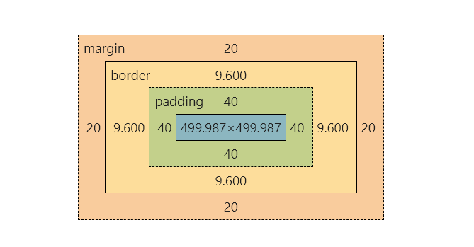
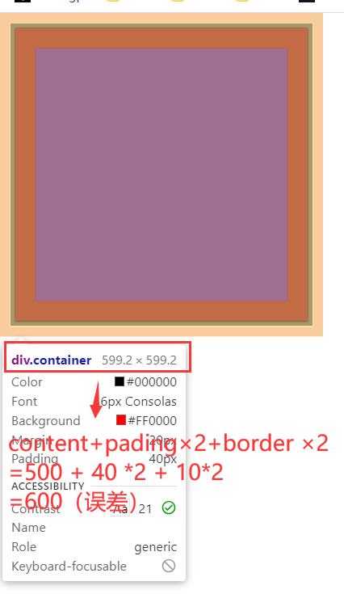

## css 盒子模型

### 1. 盒子的显示方式

1. 块元素 `display:block;`

   - 独占一行,上下排列

   - 可以css设置宽高

   - 默认高度由内容撑开,默认宽度占满父元素。

   - 常见的块元素：html body h1-h6 hr p div li ol ul dl dt dd table caption tbody thead tfoot form option


2. 行内元素 `display:inline;`

   - 不独占一行,从左到右排列,一行容不下自动换行。

   - 默认高度由内容撑开,默认宽度由内容撑开。

   - 不能通过css设置宽高

   - 常见的行内元素：a span label br em strong sup sup del ins


3. 行内块元素 `display:inline-block;`

   - 不独占一行。

   - 默认宽度和高度都是由内容撑开，一行容不下当前的元素自动换行。

   - 可以通过css设置宽高。

   - 常见的行内块元素：img input textarea select button th td iframe


### 2. css盒模型的组成：

1. content 内容
2. padding 内边距
3. border 边框
4. margin 外边距
  
  css会把所有的html元素都看作盒子，所有的样式也都是基于这个盒子的。默认情况下，css盒子模型是content-box。

### 3. 盒子模型的种类

1. `box-sizing:content-box;`：这种盒子的width属性、height属性, 只由content构成。(width和height设置多大，content就是多大)
2. `box-sizing:border-box;`ie怪异盒模型：此时，盒子的大小（width、height）变为由content、padding、border构成。
3. `margin`: 不管哪种盒模型，margin属性只会改变盒子的位置，并不会改变盒子的大小。
   **content-box:**

```html
<!DOCTYPE html>
<html lang="zn-CH">
<head>
    <meta charset="UTF-8">
    <title>Rock学前端</title>
    <style>
        div {
            box-sizing: content-box; /*默认的黑子模型*/
            background: red;
            width: 500px; /*内容(content)的宽*/
            height: 500px; /*内容(content)的高*/
            padding: 40px;
            border: solid 10px black;
        }
    </style>
</head>
<body>
<div class="container">
</div>
</body>
</html>
```

**显示的效果**

<div>

<span> &nbsp;&nbsp;&nbsp;</span>

<br/>
</div>

此处的border为9.6px,content也和500有一定误差，因该是浏览器样式计算的问题，知道原因的大佬可以解答一下，感谢！
**border-box:**

```html
<!DOCTYPE html>
<html lang="zn-CH">
<head>
    <meta charset="UTF-8">
    <title>Rock学前端</title>
    <style>
        body{
            margin: 0;
        }
        div {
            box-sizing: border-box; /*IE怪异盒模型*/
            background: red;
            width: 500px; /*content的width + padding*2 + border*2 */
            height: 500px;
            padding: 40px;
            margin: 20px;
            border: solid 10px black;
        }
    </style>
</head>
<body>
<div class="container">
</div>
</body>
</html>
```

**显示效果：**


### 4. 细说content(以div为例子)

**content-width**

1. 如果不设置width,默认宽度是一整行。此时的width是随时变化的，会随着窗口的变化而变化。
2. 如果设置了 width,那么就会固定大小，当窗口太小的时候，就会出现滚动条。
3. min-width、max-width 属性可以设置最小的宽度。对于min-width,当大于这个值的时候，以实际窗口大小为准。不能小于这个值，窗口大小小于这个值会出现滚动条。
4. max-width 属性可以设置最大宽度。对于max-width,当大于这个值的时候，以max-width为准。小于这个值的时候，窗口大小小于这个值会使得内容（content）变小。对于max-width永远不会出现滚动条。
5. max-width、min-width默认一般不和width混用。

**content-heigth**

1. 盒子的height默认不设置高的情况下，高度由内容撑开。设置了高度就会以默认高度为准。
2. max-height 设置最大高度，当内容太高的时候（比max-height高），就以设置的max-height为准，不再变得更高。
3. min-height 不管内容多高，高度不能低于min-height。

### 5. 细说padding(以div为例子)

```html
<!DOCTYPE html>
<html lang="zn-CH">
<head>
    <meta charset="UTF-8">
    <title>Rock学前端</title>
    <style>
        div {
            height: 300px;
            width: 500px;
            background-color: orange;
            /* padding-left: 10px;
             padding-top: 20px;
             padding-right: 30px;
             padding-bottom: 40px;*/

            /*左、上、右、下*/
            /*padding: 20px 30px 40px 10px; */

            /*上下10 左右20*/
            /*padding: 10px 20px;*/

            /*上10 下30 左右20*/
            padding: 10px 20px 30px;
        }

        span {
            padding: 10px 20px;
            background-color: deeppink;
        }
    </style>
</head>
<body>
<div class="container">
    I'm div!
</div>
<hr>
<span>
    I'm span! 我的上下padding 不占位置，左右正常显示
</span>
<div>
    Lorem ipsum dolor sit amet, consectetur adipisicing elit. A, repellat?
</div>
<!--行内快元素没有这个问题-->

</body>
</html>
```

**padding注意事项：**	
	- padding 元素设置padding-top 和padding-bottom对行内元素不生效。
	- padding 不能为负数

### 7. 细说border

```html
<!DOCTYPE html>
<html lang="zn-CH">
<head>
    <meta charset="UTF-8">
    <title>Rock学前端</title>
    <style>
        .container {
            /*默认border-width是3px*/
            /*border: red dashed 10px;*/
            /*  border-width: 10px;
              border-style: dashed;
              border-color: red;*/

            /*  border-left-color: red;
              border-right-color: lime;
  
              border-width: 10px;
  
              border-left-style: dashed;
              border-right-style: solid;
              border-top-style: dotted;
              border-bottom-style: double;*/

            border-left: red solid 15px;
            border-top: lime dashed 20px;
            border-bottom: black dashed 20px;
            border-right: gray double 20px;


            width: 500px;
            height: 300px;
            background-color: pink;
        }
    </style>
</head>
<body>
<div class="container">

</div>
</body>
</html>
```

### 8. 细说margin

margin可以调整元素的外边距，但是margin有很多使用的注意事项。

1. 子元素的margin,参考父元素的content计算。
2. 上、左margin影响自己，右、下影响其它的兄弟。
3. 块级元素、行内块元素都可以设置自己的margin,  但是，行内元素只能设置左右的margin,上下的margin设置无效。
4. margin 的值如果是auto，如果把一个块级元素的margin左右值设置为auto,就可以实现所有居中。（亲测 行内元素和行内块都不行）
5. margin 的值可以是负数(padding 不行)

### 9. margin塌陷问题

当父元素的中的第一个子元素设置了margin-top,最后一个子元素设置了margin-bottom的时候,就会出现margin的值从子元素上跑到父元素父元素上的现象。
解决办法：

- 给父元素加一个border属性 `border:transparent 1px solid;`
- 给父元素加一个padding值 `padding:1px;`
- 给父元素加一个overflow `overflow:hidden`;


